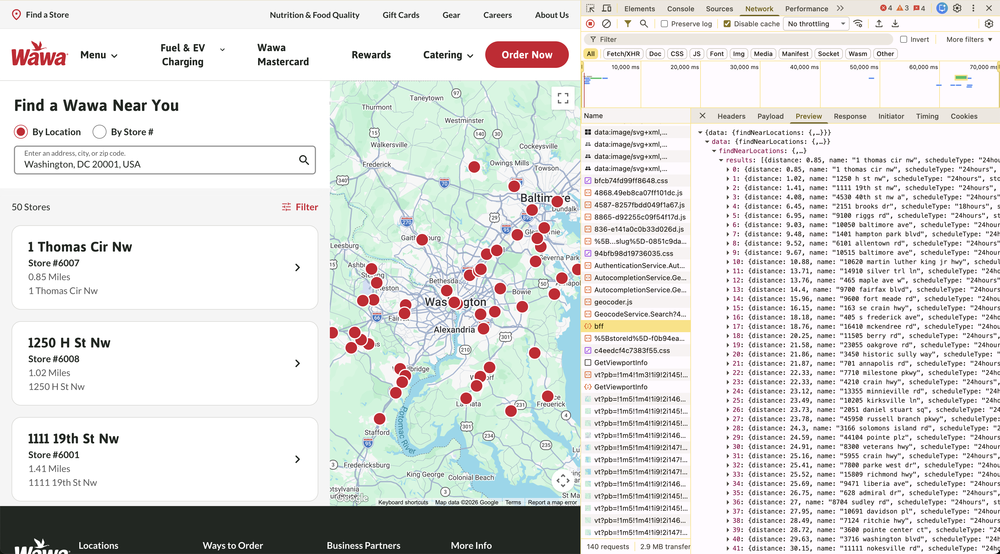

## How close are the two closest Wawa stores?

The two closest Wawa locations are 494 meters apart, located at 912-916 Walnut Street and 150 South Independence Mall West in Philadelphia, Pennsylvania.

Here are the top 10 closest Wawa locations:
 
| Distance (meters) | Store A | Store B | Google Maps Link |
|-------------------|---------|---------|------------------|
| 494 | [912-916 walnut st](https://www.wawa.com/locations/0103) | [150 s independence mall w](https://www.wawa.com/locations/8131) | [Directions](https://www.google.com/maps/dir/?api=1&travelmode=walking&origin=39.948289,-75.156638&destination=39.94919977,-75.15096568) |
| 503 | [525 burmont rd](https://www.wawa.com/locations/0012) | [3800 garrett rd](https://www.wawa.com/locations/0212) | [Directions](https://www.google.com/maps/dir/?api=1&travelmode=walking&origin=39.947078,-75.30158&destination=39.943979,-75.297279) |
| 522 | [8240 west chester pike](https://www.wawa.com/locations/8070) | [202 s state rd](https://www.wawa.com/locations/0014) | [Directions](https://www.google.com/maps/dir/?api=1&travelmode=walking&origin=39.965574,-75.280898&destination=39.96122,-75.27861) |
| 522 | [3604 chestnut st](https://www.wawa.com/locations/0055) | [3724-3744 spruce st](https://www.wawa.com/locations/0179) | [Directions](https://www.google.com/maps/dir/?api=1&travelmode=walking&origin=39.954701,-75.1951&destination=39.951065,-75.19898) |
| 566 | [435 e baltimore ave](https://www.wawa.com/locations/8082) | [100 e baltimore pike](https://www.wawa.com/locations/0100) | [Directions](https://www.google.com/maps/dir/?api=1&travelmode=walking&origin=39.91579,-75.38101&destination=39.916213,-75.387627) |
| 567 | [3711 w lincoln hwy](https://www.wawa.com/locations/0263) | [600 nova way](https://www.wawa.com/locations/8211) | [Directions](https://www.google.com/maps/dir/?api=1&travelmode=walking&origin=39.984364,-75.93401&destination=39.982267,-75.927941) |
| 598 | [418 w baltimore pike](https://www.wawa.com/locations/8128) | [5337 baltimore pike](https://www.wawa.com/locations/0293) | [Directions](https://www.google.com/maps/dir/?api=1&travelmode=walking&origin=39.926556,-75.30339&destination=39.925625,-75.310294) |
| 661 | [1 thomas cir nw](https://www.wawa.com/locations/6007) | [1250 h st nw](https://www.wawa.com/locations/6008) | [Directions](https://www.google.com/maps/dir/?api=1&travelmode=walking&origin=38.90533451,-77.03234581&destination=38.8997896,-77.029591) |
| 695 | [600 rte 38 e](https://www.wawa.com/locations/8337) | [2801 rte 73 s](https://www.wawa.com/locations/8419) | [Directions](https://www.google.com/maps/dir/?api=1&travelmode=walking&origin=39.94298,-74.96912&destination=39.936746,-74.969634) |
| 744 | [910 macdade blvd](https://www.wawa.com/locations/8108) | [1550 chester pike](https://www.wawa.com/locations/8007) | [Directions](https://www.google.com/maps/dir/?api=1&travelmode=walking&origin=39.910383,-75.278666&destination=39.904548,-75.28294) |

## What is Wawa?

Before we begin, I just want to explain to the uninitiated what exactly Wawa is. 

Wawa is a 24/7 regional gas station convenience store, which gained massive popularity (at least where I lived) due to being one of the first fast food chains to implement a touch screen ordering system, all the way back in 2002. While Burger King was advertising with the slogan "Have it your way", Wawa was delivering on this very same promise in a revolutionary way.

The quality of the food at Wawa is what I would call objectively "good", but the cuisine offered at Wawa elevates itself to subjectively "amazing" at 3am, when every other store is closed and Wawa is literally the only option.

## Why do you care?

You might be thinking, "Okay, but who cares how close they are?", and the answer is probably not very many people. 

The reason *I* care is because the density of Wawa locations has sort of become a running joke where I live. Anecdotally it feels like you can't drive a mile without seeing at least two. On my way to work I pass around ten different Wawa locations. I've even seen neighborhood signs protesting the development of new Wawas.

Basically, where I live, Wawa is Inevitable.

## Let's get to work!

### Step 1: Download the data

When you perform a Google search for "how many wawas are there", you get a top result from a scraping website charging $85 for the dataset. 

Rather than spending any money on answering this silly question, we will simply scrape the data from the Wawa store locator API ourselves.

### Step 1 (really): Scrape the data yourself

When we navigate to the Wawa website, we see that there is a "Find a Wawa Near You" tool. Opening up the dev tools panel, there's a graphql endpoint that returns the 50 closest wawas given a latitude and longitude.

I played around with this endpoint in Bruno, and it seems like the only requirement for this endpoint is having a valid `User-Agent` header, nothing else is validated. 

Once I had this figured out, I added this query to a pyton script, and gave the python script several "seed" data points: one for every state that Wawa is present. I chose the seeds due to some of the clusters where Wawas are located being far enough from one another that a single seed would not suffice.

Every time I get a list of 50 Wawas, I check if each Wawa was already found, and if not, add the furthest new Wawa that is north-west, south-east, south-west, and north-east of my position to the list of seed coordinates. This ensures I branch out as far as I can from each seed coordinate, while not searching any areas that don't have any Wawa locations.

To avoid being throttled, I left a generous 45 second `sleep` in between each call to the location finder endpoint.

This left me with a list of 1,198 Wawa locations. However one of the results returned from this endpoint is invalid, so in reality we are left with a true count of 1,197 Wawa locations. This count is confirmed by the scraping website I found earlier, so I have a somewhat high confidence in its accuracy.

### Step 2: Find how far each Wawa is from all the others

Since I have the latitude and longitude of every Wawa, finding the distances between them is pretty simple using the [Haversine formula](https://en.wikipedia.org/wiki/Haversine_formula). I calculate every distance and store it in a `dict`, then sort the keys of the `dict` by smallest to largest to find the closest Wawa locations.

### Step 3: Questions, answered...?

I was rather disappointed to find that none of the top ten closest Wawa locations that I frequent, as this exercise arose from a suspicion that the Wawa's I go to were some of the closest that exist. 

However if I expand my results out to the top 15, there is one near me that I drive by every week but don't often go into, so that's kind of cool.

### Step 4: Further research needed

Something else caught my attention from reviewing the results above: when I looked at the Google maps directions, it seems the reported latitude and longitudes are *not exactly* where the Wawa building is. This results in errors on the order of tens of meters. When the results are as close as they are, first place could be decided by measuring from a more correct location.

Until I feel motivated enough to manually determine the *true* coordinates of each Wawa store, we will have to rely on Wawa's self reported, yet inaccurate, data.

Want to run the code yourself? [Check it out on GitHub here](https://github.com/elliscode/elliscodedotcom/tree/main/s3/blog/the-closest-two-wawas)! 

