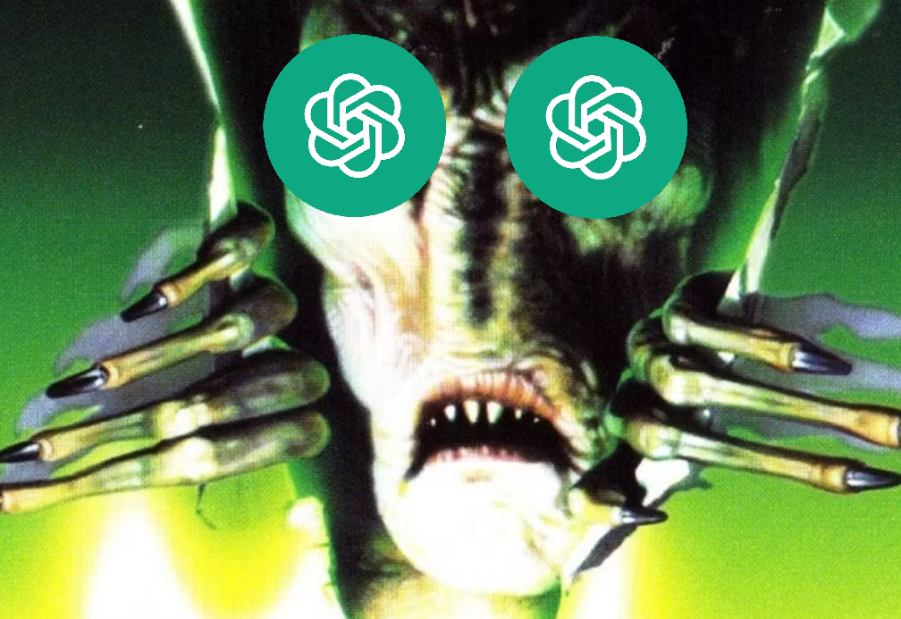
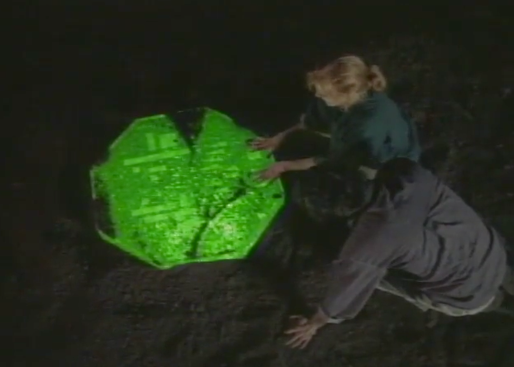
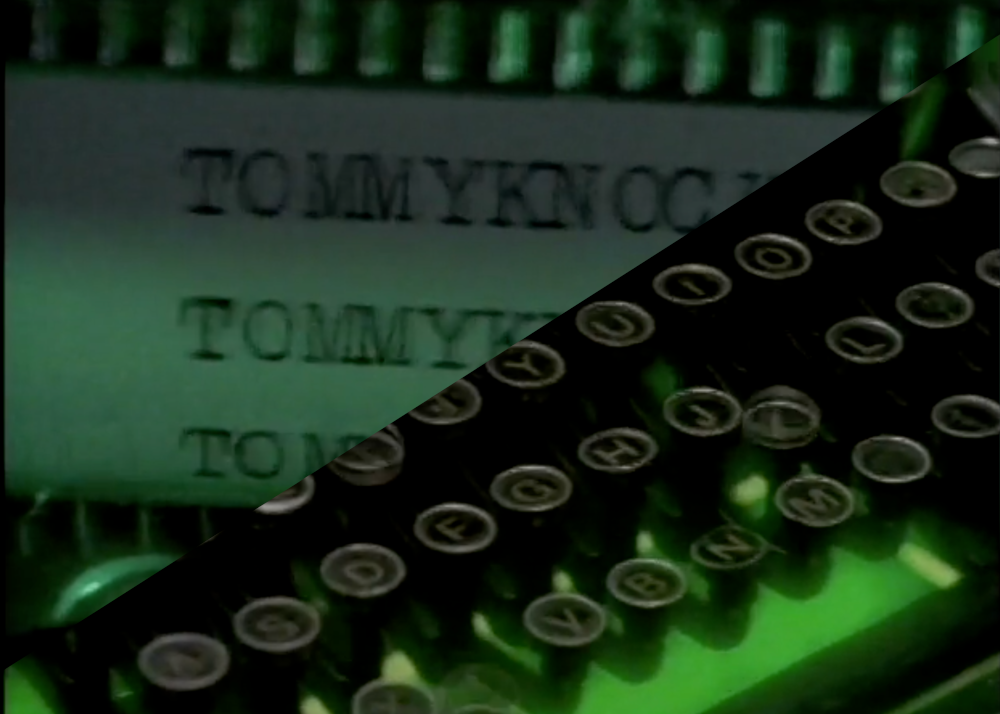
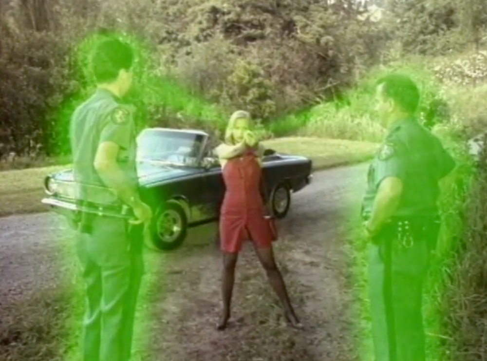
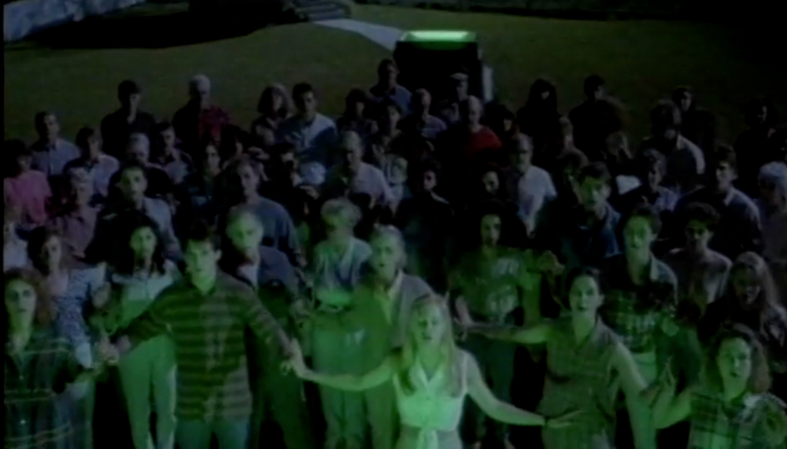

Title: "The Tommmyknockers" and the parallels with Generative AI
Date: 2026-02-20
ThumbnailURL: 000-thumbnail.png

This piece contains heavy spoilers about *The Tommyknockers* by Stephen King, both the novel and the 90's miniseries. If you haven't gotten around to reading this almost 40-year-old novel, proceed at your own risk.

## What is *The Tommyknockers*?

*The Tommyknockers* is a story about a small town in Maine. One day a green, glowing, alien technology is found in the woods outside town. One by one the inhabitants gradually figure out how to "harness" this technology for their own purposes. Those who embrace the technology are suddenly transformed into genius inventors, whose gadgets perform miraculous feats, while those that avoid it are shamed for not partaking in its plentiful bounties. As the story progresses, calamity ensues when the new technology starts making people act in strange ways. Violent groupthink threatens those who don't adopt the new tech, and the heavy users are ultimately transformed into alien-human hybrids.

At first glance, this story is first and foremost a thinly veiled allegory for substance abuse, peer pressure, and succumbing to addiction. King himself admits that this was the last book he wrote before he "cleaned up his act". Though a bit on the nose, a story like this is a great vehicle to portray addiction and its effects, without including any explicit references or portrayals of illegal substance use. Back in the 90s, portrayals of drug use were heavily moderated on television, so this also made it pretty easy to translate to a made for TV miniseries without censoring much.

Before I go further, I want to be clear that I am *not* claiming using generative AI too much is anywhere near as bad as substance abuse addiction. However as you progress through the story, with a perspective of a human living in 2026, it's hard not to notice the uncanny parallels to generative AI.

## Nobody understands the technology

In *The Tommyknockers*, the technology the townspeople discover allows them to invent fantastic contraptions, many of which automate tedious tasks. For instance, the postmaster in town invents an automated letter sorting machine, but can't explain how she built it or how it works. Similarly, the main character's partner fixes the broken water heater in their home, and the following interaction demonstrates how severely she lacks understanding of what she did.

> Gardener: They've turned you into Einstein, huh?
> 
> Bobbi: Well, no, not Einstein exactly, 'cause Einstein knew things. I don't know anything. I mean, I have no idea how I got the hot water heater to work. I just knew as I was doing it. Everything seemed clear as a bell.

Just as the residents do not understand the alien technology which they are using, neither do many who use generative AI grasp exactly what it is they are using.  Many people believe generative AI is "thinking" when it responds, while in reality it is just highly tuned to predict the next word that sounds the best. Many believe generative AI to be sentient in some way, but in reality generative AI is simply *really* good at simulating sentience in its responses. And most similarly to the citizens of Haven, many who use generative AI don't understand the output whatsoever, nor do they make any attempt to. They just know "it works", and that's good enough for them.

## Good is amplified, as well as bad

The two previous examples I gave of inventions generated by the townsfolk had good intentions, however not all of them were so well-intentioned. The same postmaster who invented the automated mail sorting machine goes on to invent a "disintegrator ray". Disguised as a tube of lipstick carried in a purse, this weapon is shown to have the power to completely liquify a stone gargoyle in the cemetery. The residents eventually engineer a Coca-Cola vending machine to be an autonomous security guard, protecting the interests of the "enlightened" townsfolk against outsiders. Even inventions without explicit malintent can have disastrous consequences, such as when a young boy invents a "vanishing box" to perform magic tricks. When he uses it on his younger brother in his magic routine, he is teleported to an alien planet with no way to return home.

While the technology of generative AI itself can be viewed through a lens of amorality, the people who use it dictate whether the outputs will be for the benefit of humankind, or the detriment of it. In modern times, we are seeing generative AI being employed to generate fake news videos, to automate scamming operations, and even to generate non-consensual deepfakes. The technology is seemingly limitless, which in the wrong hands can have disastrous real world results. 

## &hellip;and insanity ensues

In *The Tommyknockers*, the heaviest users of the new technology get so engrossed in their machinations, that they become utterly obsessed with the glowing object and what it can do. Neglecting their degrading health, their ruined relationships, and the loss of their teeth, they place the technology above all else, and eventually succumb to it.

With all the articles coming out about "chatbot psychosis" lately, this plot point feels like a direct jab at the current state of generative AI's most unstable devotees. Almost like *The Tommyknockers* came out this year and is a direct criticism of the worst potentiality of generative AI dependence.

## Is it really that bad though?

I get it, I am being a bit dramatic here. I do not earnestly believe that *everyone* who uses generative AI will turn into a mindless husk of a human, walking through life as a lobotomized shell of their former selves. I *do* think that stories such as these serve as a good warning to not only temper expectations of new technologies, but to limit our reliance on them as well. 

Just as one can "drink responsibly", "gamble responsibly", or "buy stock options responsibly", one can also "generate responsibly". Everyone using generative AI in any capacity should be aware of how slippery the slope is, and just what can happen if they "lose themselves" in the experience. 

Perhaps I just came up with a great new disclaimer for our AI overlords to absolve themselves of responsibility, but I believe many of us would benefit from viewing generative AI use as a dangerous, addictive habit with potentially dire consequences.