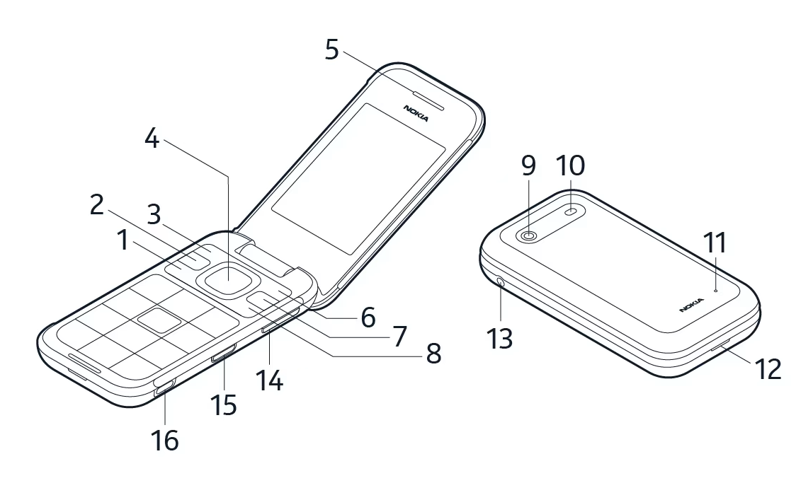
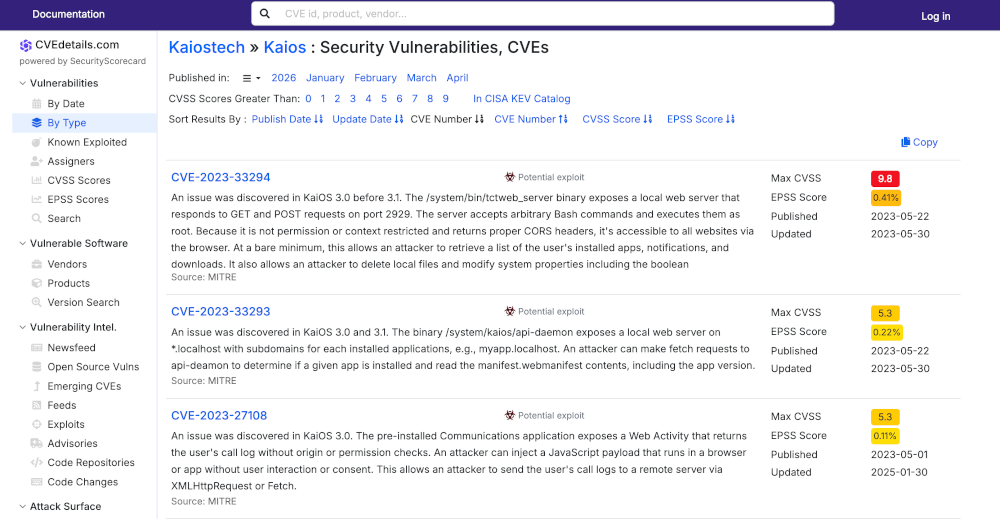
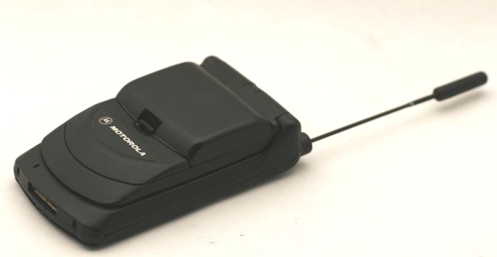
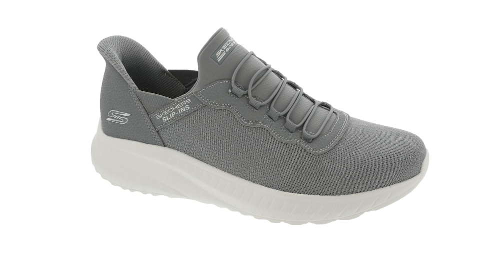
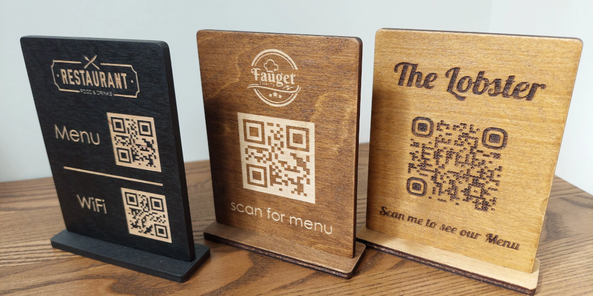

Title: Why I use a flip phone
Date: 2026-04-04
ThumbnailURL: 000-flip-phone.png

It is the year 2026. I am a professional software developer, and I use a flip phone.

You may have already come up with some reasons as to why you think I have a flip phone, and they're probably all wrong.

## It's not about security

Some people think because I have a flip phone, I must be a privacy nut, or an advanced security researcher or something, but none of that is true. Having a flip phone does not make me more secure in any way, in fact it probably makes me less secure. 

I have a [Nokia 2780](https://www.hmd.com/en_int/support/nokia-2780-flip-user-guide/keys-and-parts), which is a flip phone released in 2022. It hasn't gotten a meaningful software update since its release. It's probably one of the least safe devices I could use, which would matter if I did anything meaningful on it.

Some people think I cannot be tracked by "big tech" or "the government" because I use a flip phone, however all of that is incorrect. Every mobile phone in the United States can have its location tracked to GPS-level precision using [LTE Positioning Protocol](https://web.archive.org/web/20260407122405/https://tech-academy.amarisoft.com/LTE_LPP.html). All it takes is your carrier to give your data to whoever asks for it, which I'm assuming happens way more often than we would like to think.

## It's not about nostalgia

I was one of the few people I knew that had no interest in phones in general growing up. I was always more interested in iPods, PDAs, or handheld gaming systems than I was a phone. I had a Motorola StarTAC for pretty much my entire childhood, while my older brother always used all my "upgrades" on our family plan.

## It's not about fashion or being trendy

OK let's face it, I'm old. I'm a dad. Being cool or fashionable flew out the window when my first kid was born, and I donned my obligatory pair of dad sneakers. Not only will I never be cool, I don't care to be.

## It's about maintaining ownership of my own time

Some people have smart devices and have no issues with self-control. I am not one of those people. 

I think when your device starts giving you notifications, and you're built like me, you've lost the battle. If there's a device telling you when things happen in your online life every time they happen, you're naturally going to grow an unhealthy relationship with your online life. So now that I have a flip phone, I set it to make no noises or notifications at all, including text messages. The only noise it makes is if I am receiving a phone call, that's it. Everything else I need to know, I can check *on my own time*.

If this were the only problem I had, the solution would be to just turn off notifications on my smartphone.

My other major issue is, given the option, my natural inclination is to fill every otherwise blank second in my life with scrolling. Scrolling what you ask? Reddit, Instagram, Hacker News, lobste.rs, random Google searches. Literally anything to get that sweet, juicy dopamine. Luckily on KaiOS, pretty much every single major website is completely unusable. Not only is the screen size hilariously small, the processor is so slow, it can't render reddit without completely crashing the browser.

## And it actully helps a lot

It's been four years since I started using a flip phone, and anecdotally I can say that I am much less distracted in general. I am also more mentally present when I am with people, including my family, friends, and coworkers. Previously when I would reach for my device in any sort of lull, I will now start taking to other people if they are available, or just thinking about thinks in my life if there is no people around.

## But what if there's something I can't do?

The answer is surprisingly simple.

- Have someone I'm with do what I need to do.
- Bring my iPad.
- Write a web app to do what I need to do.
- Just don't do it.

These four options take care of anything I may need, from paying for parking through an app, to looking at a QR code menu at a restaurant, to using a work-specific app I need for my job.

## I need to live like this, but not everybody does

One thing I learned about myself over the past few decades is not only am I prone to addiction, but I am also very lazy. And the easiest way to prevent me from indulging in an addiction, is to take away the easy way to do it. 

For instance, the easiest way to beat my scrolling addiction is to just remove the possibility for scrolling. I still need to use the "Screen Time" app on my iPad, and I set a hard limit on the amount of reddit to 10 minutes, and only my wife knows the passcode. So using a flip phone is not the complete solution. But just removing the ever-present temptation that a smartphone poses has really improved my life.

I'm not evangelizing using flip phones, or think everyone should go the route I did. In fact when I started, it was only sort of annoying to live life using a flip phone, and over the past 4 years it has gotten increasingly more annoying. 

For example, nobody who works at the big box hardware stores knows where anything is anymore, they recommend using the app. Some doctor's offices don't have the option for paper-based paperwork anymore, it's just through an app or a website, which I need to bring my iPad in to do. 

I don't really think that most people *could* live life in the modern world with a flip phone. But if you're considering a digital detox, I would like to inform you it is definitely possible, and worth it if you have the patience.