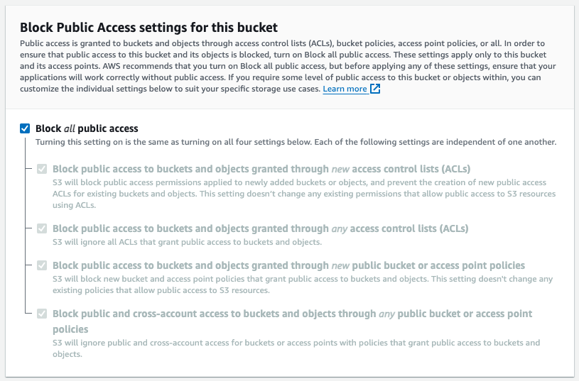
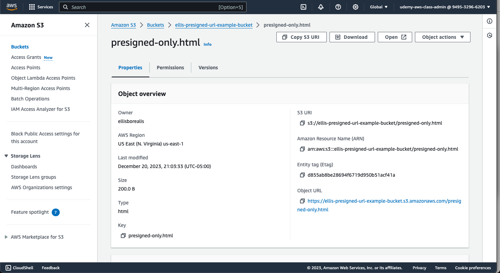
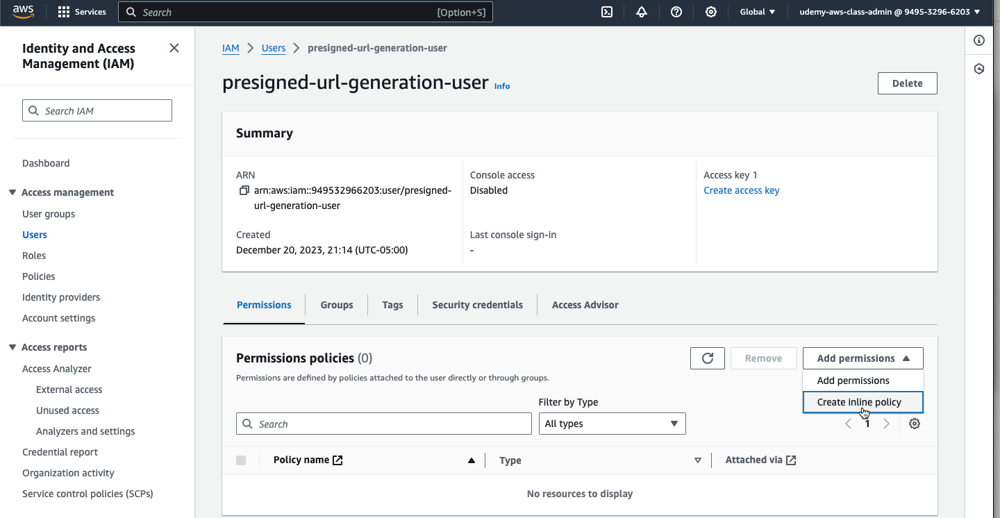
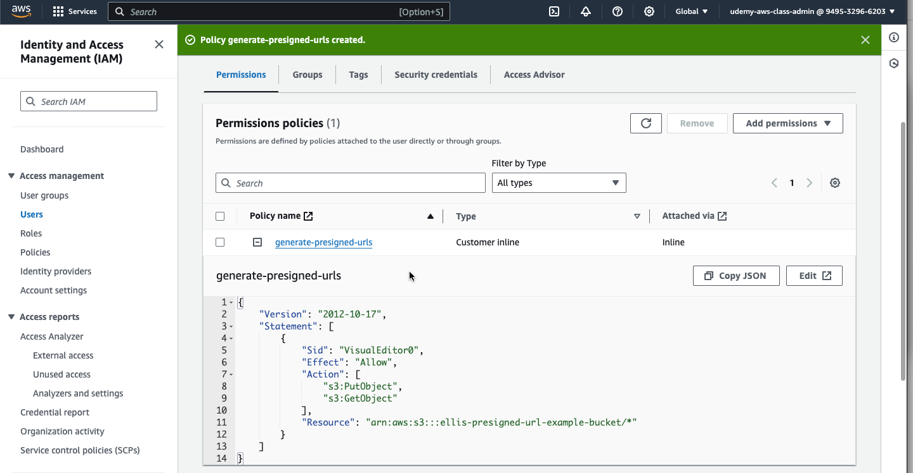

# Generating a presigned URL from a Lambda function

In this tutorial, we will go over the exact steps needed in order to generate a presigned url form a lambda function. 

When you create a presigned URL, the presigned URL belongs to the session that created it, and this means the presigned URL only lasts as long as the session. When you create a presigned URL from a lambda function, it will by default use the short lived session that the lambda automaticlly generates upon execution, which often expires in a few seconds, rendering your presigned URL almost immediately useless.

To avoid this issue, we will create an IAM user with very limited permissions, and have our lambda assume the identity of this IAM user in order to allow our presigned URL to work as expected.

## Step 1: Create a file in a private S3 bucket

I will assume you already have created a private S3 bucket, with all public access disabled. If you have not, expand the following section for instructions.

> ### Creating a private S3 bucket
> 
> First, navigate to the S3 service by searching for "S3" in the search bar
> 
> 
> 
> Next, create a bucket by pressing the "Create bucket" button. Complete the form with the following information:
> 
> - AWS Region: whichever region you are working in
> - Bucket type: General purpose
> - Bucket name: the public name for the bucket that will show up in your signed URLs
> 
> Ensure the "Block Public Access settings for this bucket" section looks like this:
> 
> 
> 
> Finally, press "Create bucket" at the bottom of the page

Navigate to your S3 bucket and upload an HTML file with the following content:

```
<!DOCTYPE html>
<html>
    <head>
    </head>
    <body>
        <h1>This page is for your eyes only</h1>
        <p>You can only see this page if you are given a presigned url</p>
    </body>
</html>
```

Navigate to the "Properties" page of the newly uploaded object



Click on the "Object URL" hyperlink and ensure the page that shows up displays an `AccessDenied` error message.


This is expected, as our bucket is set to "Block all public access". However, we will be able to access this object in this private bucket by generating a presigned URL. Next, we will create the IAM user which will be generating the presigned URL.

## Step 2: Create an IAM user and add permissions

Navigate to the IAM service by searching for "IAM" in the search bar


Navigate to the "Users" link on the left, then press the "Create user" button


Fill out Step 1 of the form with a name indicating your user will only be used to generate signed urls, i.e. `presigned-url-generation-user` and press "Next

On Step 2 of the form, just press "Next", without adding any permissions

On Step 3, press the "Create User" button at the bottom-right

Navigate to the newly created user, then press "Add permissions" and select "Create inline policy"



In the "Select a service" dropdown, select "S3"

Check the permissions `GetObject` and `PutObject`, these are the only ones we will need in order to create POST and GET presigned URLs. If you are not planning on performing any presigned POSTs, only add the `GetObject` permission.

In the "Resources" section, ensure you restrict the bucket to the bucket you created in Step 1 of this guide, as shown below. Ensure you include the `/*` after the bucket ARN to ensure it has access to all objects within your bucket.


Press the "Next" button at the bottom of the page, then enter a name, then press the "Create policy" button

Once returned to the IAM user page, expand the newly created inline policy and ensure it looks something like this:



## Step 3: Create an access key for your new IAM user

